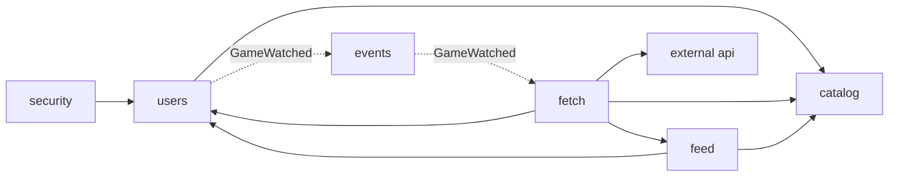
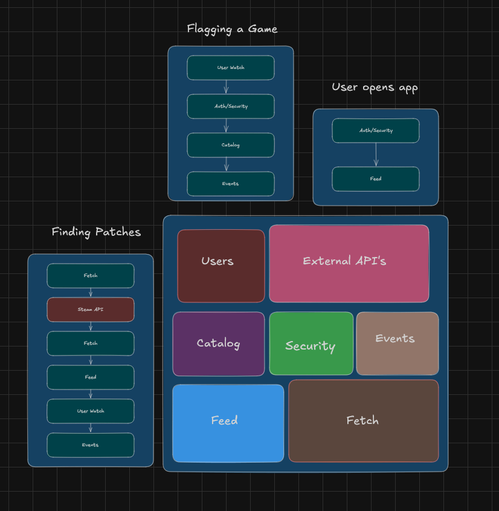

# Game Patch Notes Aggregator

[](https://github.com/Vandrae/patch-notes-aggregator/actions/workflows/ci.yml)

A Spring Boot REST API that lets a user search a large catalog of games, build a
personal watchlist, and get a news-feed-style view of recent patch notes for
just the games they care about. Built to demonstrate skills a lot of junior
Java portfolios skip: scheduled background jobs, third-party API integration,
data normalization across inconsistent sources, and proper auth.

**Status:** work in progress toward a production app. Done so far: **Steam-only sign-in**, the **full Steam catalog**
(~190,000 games, imported automatically and kept current), search with genre / rating / age filters, watchlist,
**adaptive** + on-demand patch-note fetching, a normalized feed, and a **React web UI** served by the same jar. Next:
non-Steam games and production packaging (Docker, CI).

**The catalog:** on first start (or whenever it holds fewer than 1,000 games) the app imports every game from Steam's
`IStoreService/GetAppList` in the background, about 15 seconds for the whole list, then refreshes nightly with only what
changed. This needs `STEAM_API_KEY`; without one, only the starter game (Dragonwilds) is searchable and Discover says so.
Search ignores case, accents, punctuation and trademark symbols ("half life 2" finds *Half-Life 2: Episode One™*). Results
are ranked by one blended score, `relevance bonus + log10(1 + popularity)`, where the bonus is 3.0 for the exact name, 1.5 for a
name starting with your text and 0 for one that merely contains it. Popularity is on a log scale, so an exact match beats a
prefix match of similar popularity ("Portal" before "Portal 2"), but a game about 100x more popular can overtake an exact
match: searching "war" puts WARDOGS, War Thunder and Warframe above an obscure game that happens to be called "WAR!". With
no query, Discover lists the whole catalog most popular first. Each result shows Steam's cover
image, a short description, and a "View on Steam" link with the Steam logo. Steam has many different games with the same name
(three are called "Deadlock"), so popularity and that link are how you tell them apart.

**Covers, icons, descriptions, genres, ratings and popularity** come from Steam's store API (`IStoreBrowseService/GetItems`, 200 games per request) in
a second background job that runs after the catalog import. Popularity is `reviews + 10 × peak players on Steam's most-played
chart`: reviews cover almost every game, and the chart covers hugely played games that have few or no reviews yet (Valve's
Deadlock has none). It is a ranking heuristic, not a statistic. Steam throttles that endpoint hard (measured: about one request
per 3 seconds, after which it answers HTTP 429), so the job is **one paced worker** that waits and retries the *same* batch when
throttled, and fetches the most useful games first (the most-played chart, then recently updated games). The first run over the
whole catalog therefore takes about **50 minutes** in the background; search works throughout and improves as it goes (Discover
shows progress). After that only new, changed or stale (30 days) games are refreshed.

**Genre, rating and age filters** (Discover and the feed) use three more things from that same request, so they cost no extra calls:
the game's top store tags, of which Steam's ten standard genres (Action, Adventure, Casual, Indie, Massively Multiplayer,
Racing, RPG, Simulation, Sports, Strategy) are kept, and Steam's own review level (1 Overwhelmingly Negative … 9 Overwhelmingly
Positive; 0 = no reviews), and the ESRB age rating Steam shows (Everyone, Everyone 10+, Teen, Mature 17+, Adults Only 18+).
Many games have no ESRB rating at all (free-to-play and Valve titles, for one), so they never pass an age filter. Pick any number
of genres and any number of age ratings (a game matches if it has *at least one* of each) and a "this review rating or better"
level; the three combine. On the feed the filter chooses *games*, so it only ever narrows the notes of games you already watch.
All of it lives in the URL (`?genre=RPG&genre=ACTION&rating=8&age=MATURE`), so a filtered view survives a reload. A game whose details haven't
been fetched yet has no genre, rating or age rating, so it's left out while a filter is on; Discover says so while the first run is going.

## Quick start

Needs **JDK 21+** (check that `JAVA_HOME` points at one; the wrapper uses it). No database setup: it uses a
file-backed H2 in `./data` by default.

```bash
./mvnw test                   # backend tests (Java only): module rules, Steam login security, catalog sync, details
                              # pacing + rate limiting, search ranking (incl. a 150,000-game scale test), normalizer, HTTP flow
./mvnw package                # tests + builds the web UI + one jar that serves both (first run downloads a local Node)
java -jar target/patch-notes-aggregator-0.1.0-SNAPSHOT.jar      # then open http://localhost:8080
```

`./mvnw package` installs a project-local Node into `web/node/` (nothing system-wide), runs the frontend tests and
builds the UI into the jar. Use `-Dskip.frontend=true` for a faster Java-only build.

**Working on the UI:** run the backend, then in `web/` run `npm run dev` (needs Node on your PATH, or use `web/node/`).
The dev server on <http://localhost:5173> proxies `/api` to the backend; start the backend with
`PUBLIC_BASE_URL=http://localhost:5173` so Steam sends you back through the proxy.

Secrets go in a git-ignored `.env` (copy `.env.example`). The Steam news endpoint is keyless; `STEAM_API_KEY` is used to
look up your Steam name and avatar at login (login still works without it, with a generic name) and, shortly, for the
full-catalog sync. Set `JWT_SECRET` (32+ chars) so sessions survive restarts. MySQL instead of H2: `docker compose up -d`,
then run with `--spring.profiles.active=mysql`.

**Tests against a real MySQL.** Most tests run on H2 in MySQL compatibility mode, which needs no setup but is not MySQL: it
accepts some SQL that MySQL rejects and serialises writes that MySQL runs concurrently. `MySqlIntegrationTest` and
`MySqlFetchStateConcurrencyTest` therefore start a throwaway MySQL 8.4 container with [Testcontainers](https://testcontainers.com)
and run the production database setup against it: every Flyway migration plus Hibernate's schema check, the catalog import
(accents, trademark signs, emoji, Japanese), search ranking and the genre / rating / age filters, watching a game through the
persisted event registry, the feed API, account deletion, and the poller. They need Docker; without it they are **skipped, not
failed**, so `./mvnw test` still works anywhere. CI always has Docker, runs them on every push, and fails if they were skipped.
They have already earned their keep: they found that two fetches finishing together, or a fetch and the poller, could
deadlock on MySQL when creating a game's schedule row (the fetch then failed until the next poll). H2 cannot show that, and
`MySqlFetchStateConcurrencyTest` reproduces it on purpose (300 racing pairs) so it cannot come back.

**With Docker** (the whole stack, no JDK or Node needed; you only need Docker):

```bash
cp .env.example .env          # fill in JWT_SECRET, MYSQL_PASSWORD, MYSQL_ROOT_PASSWORD (and STEAM_API_KEY)
docker compose -f compose.prod.yaml up -d --build
docker compose -f compose.prod.yaml logs -f app      # then open http://localhost:8080
```

How it fits together:

- The **`Dockerfile` has two stages.** The first (a full JDK) runs the same `./mvnw package` as above, which also builds the web
  UI. The second (a JRE only) receives just the finished jar, so the image holds no source, compilers or Node. It runs as a
  non-root user and has a health check against `/actuator/health/readiness`. Dependencies are resolved before the source is
  copied, so editing code does not re-download them.
- **`.dockerignore`** keeps `.env`, `data/`, build output and `.git` out of the build, so a secret can never end up inside an image.
- **`compose.prod.yaml`** starts the app and MySQL 8.4. MySQL keeps its data in a named volume (`down` keeps it, `down -v` wipes
  it) and is not published to your machine; the app starts only once MySQL is healthy. Required secrets are written
  `${NAME:?message}`, so compose refuses to start when one is missing instead of running without it. Set `PUBLIC_BASE_URL` to
  your https address when you deploy (https also turns on the Secure cookie flag).
- `compose.yaml` (without `.prod`) is the development one: only a MySQL with its port open, for `--spring.profiles.active=mysql`.

**The `prod` profile** (`SPRING_PROFILES_ACTIVE=prod`; `compose.prod.yaml` uses `prod,mysql`). It adds `application-prod.yml` and two startup
checks, so a deployment that would be unsafe or quietly broken fails at startup with a clear message instead of coming up:

- **`JWT_SECRET` must be set** (32+ characters). Without it the app would invent a random signing key on every start, signing
  everyone out and breaking any second instance.
- **`PUBLIC_BASE_URL` must be an https address**, because the session cookie and the Steam sign-in redirect must not travel
  over plain http. `http://localhost` is the one exception, so you can try the production setup on your own machine
  (with a warning in the log). A missing `STEAM_API_KEY` only logs a warning: the app works but cannot import the catalog.
- The profile also turns on **graceful shutdown** (in-flight requests and a running poll tick get up to 30 seconds), **error
  responses without messages or stack traces**, **response compression**, trusting a reverse proxy's `X-Forwarded-*`
  headers (`FORWARD_HEADERS_STRATEGY`; set it to `none` if clients reach the app directly, because then they could forge
  them), and exposes only `/actuator/health` over HTTP (metrics are recorded but not exposed).

**Security headers** (every profile, on every response): a strict **Content-Security-Policy** (scripts, styles, fonts and
connections only from the app's own origin, images also from Steam's CDN, no inline script, no eval, no framing, no plugins),
`Referrer-Policy: no-referrer`, a `Permissions-Policy` that switches off camera, microphone, geolocation, payment and USB,
`Cross-Origin-Opener-Policy: same-origin`, plus Spring Security's defaults (`X-Content-Type-Options`, `X-Frame-Options: DENY`,
no caching of API responses, and `Strict-Transport-Security` for one year on https requests). The policy was checked in a
browser against every page (feed, Discover, watchlist, account) with no violations.

**Continuous integration** (`.github/workflows/ci.yml`, on every push): the backend tests on JDK 21 (including the real-MySQL tests above), the frontend typecheck, tests
and build on Node 24, then the Docker image is built and the production compose stack is started against a real MySQL 8.4
and smoke-tested (health, the web app, a client-side route, the API rejecting anonymous calls, the security headers, the
`prod` profile being active, and Flyway applying its migrations on MySQL). A failing backend test is shown as an annotation on the run page.

**Signing in:** there are no passwords. Open <http://localhost:8080>, click **Sign in through Steam**, sign in on Steam's own
page, and you are sent back signed in (an HttpOnly session cookie). The app has a feed (with a per-game filter), game
discovery with search and a one-click Watch (each patch note shows its game's Steam icon, falling back to an initials tile until the icon has been fetched), a watchlist, and an account page (sign out / delete account).

| Method | Route | Notes |
|---|---|---|
| GET | `/api/auth/steam/login?next=/path` | public; redirects to Steam. `next` must be a same-site path |
| GET | `/api/auth/steam/callback` | public; Steam returns here; verifies, creates/updates the user, sets the session cookie |
| POST | `/api/auth/logout` | clears the session cookie |
| GET / DELETE | `/api/me` | who am I (401 = signed out) / delete my account and watchlist |
| GET | `/api/games?q=&genre=&minRating=&age=&page=&size=` · `/api/games/{id}` | catalog search (name contains, case-insensitive); `genre` and `age` (ESRB, e.g. `TEEN`) are repeatable (any of), `minRating` is Steam's 1-9 review level |
| GET | `/api/catalog/filters` | the genres, review ratings and age ratings the filters offer |
| GET | `/api/watchlist` | caller's watchlist |
| PUT / DELETE | `/api/watchlist/{gameId}` | idempotent add (201 new / 204 already) and remove |
| GET | `/api/feed?page=&size=&gameId=&genre=&minRating=&age=` | patch notes for watched games, newest first; `gameId` narrows to one watched game, `genre`/`minRating`/`age` to watched games that match; `emptyState` explains an empty page |

Everything except the `/api/auth/steam/**` routes, logout and `/actuator/health` requires a session. The browser session
is an HttpOnly cookie, so writes from the browser must echo the `XSRF-TOKEN` cookie in an `X-XSRF-TOKEN` header (CSRF
protection). Scripts can instead send `Authorization: Bearer <jwt>`, which needs no CSRF header. User-scoped routes take
the user from the verified token's subject, never from the URL. Steam only reveals a SteamID (no email), which is all we store
besides your display name and avatar.

## Modular monolith

One deployable, eight modules. Each is a top-level package whose root holds its public API and whose
`internal` sub-package is off limits to other modules. The allowed dependencies are declared in each module's
`package-info.java` and **enforced by a test** ([ModularityTests](src/test/java/com/vandrae/patchnotes/ModularityTests.java),
Spring Modulith), so a stray import across a boundary fails the build.



| Module | Responsibility |
|---|---|
| `users` | accounts + watchlist ("User Watch"); no auth logic |
| `security` | "Sign in through Steam" (OpenID 2.0), HS256 JWT session cookie, CSRF, HTTP security rules |
| `catalog` | game catalog + search; seeded from `app.catalog.seed-games` |
| `externalapi` | Steam client with timeouts and retry/backoff; returns Steam's own DTOs |
| `fetch` | scheduled poller, on-demand fetch, `ArticleSource` adapters, normalizer |
| `feed` | article storage (upsert + dedup) and the per-user feed endpoint |
| `events` | shared event contracts (`GameWatched`, `ArticlesIngested`) |
| `web` | serves the React app (built from `web/`) at its client-side routes |



*The design diagram: the modules on the bottom right, and how a request travels through them in each of the three flows.
The diagram predates the `web` module, which only serves the React app.*

The three flows from the design diagram map to code like this:

- **Flagging a game:** `PUT /api/watchlist/{id}` → JWT check → catalog existence check → save → publish `GameWatched`.
- **Finding patches:** `GameWatched` (immediately) or the adaptive scheduled poll (below) → fetch → Steam API → normalize → feed (upsert) → publish `ArticlesIngested`.
- **User opens app:** JWT check → feed query scoped to the caller's watchlist.

`GameWatched` is delivered through Modulith's persisted event registry, so an unprocessed event survives a crash
and is re-published on restart. Nothing consumes `ArticlesIngested` yet; it is the hook for notifications.

### Adaptive polling

Asking Steam about every watched game every 30 minutes costs 48 calls a day per game whether it patches daily or yearly,
which does not scale (5,000 watched games would be ~240,000 calls a day). Instead each watched game has its own schedule
in `game_fetch_state`, and the poller wakes every 30 seconds to take whichever games are due.

- **When to look again** (`PollSchedule`, pure arithmetic): after a successful poll, the wait is the time since the game's
  newest patch note divided by 4, kept between 15 minutes and 24 hours. A game patched an hour ago is checked within the
  hour; one patched last week, daily; a game with no patch notes (or no news feed) daily. A new patch note snaps a quiet game
  back to frequent checks by itself, with no counters to keep. Waits are shortened by up to 10% at random so games do not all
  fall due together; because jitter only shortens, **no watched game goes unchecked for more than 24 hours**.
- **Failures** back off on their own schedule (5 minutes, doubling, up to 6 hours) and never delay other games.
- **Pacing:** requests leave at a steady 5 per second (measured: Steam's news API did not throttle 100 uncached requests at
  about 4 per second). If Steam answers HTTP 429 the poller slows down, stands down for 30 seconds and leaves the rest due.
  Retrying a 429 immediately would only count against the limit, so the news client reports it instead of retrying.
- **On demand:** starting to watch a game still fetches it at once, and that fetch sets the game's schedule too, so it is not
  polled again straight away. Games nobody watches lose their schedule row and are never polled.
- **Metrics** (Micrometer; not exposed over HTTP yet): `patchnotes.fetch.polls` by outcome, `patchnotes.fetch.articles`,
  `patchnotes.fetch.tracked`, `patchnotes.fetch.due` and `patchnotes.fetch.lag.seconds` (how long the most overdue game has
  waited; a number that keeps growing means the poller cannot keep up).
- **Tuning** is under `app.fetch` in `application.yml`. The 24-hour cap comes from one method, `PollSchedule.maxIntervalFor`,
  which is where a slower tier (say weekly checks for games with no patch note in a year) will plug in.

With the illustrative mix of 5% busy, 25% moderate and 70% quiet games, 5,000 watched games come to roughly 22,000 calls a day
instead of 240,000 (an estimate, not a measurement). One instance only: the overlap guard is in-memory, so several instances
would need a lease on the state rows.

### What the Steam data actually looks like

Checked against the live API for Dragonwilds, and the normalizer's tests use these real titles:

- The feed mixes developer posts (`feed_type=1`) with press and SteamDB links (`feed_type=0`); only the former can be patch notes.
- The `patchnotes` tag is only set on *some* real patches ("1.0.0.5 Patch Notes" lacks it), and the other tags are moderation noise.
- Many real patches never say "patch": "0.12.0.4 is live!". Meanwhile "An Update From Mod Dutch", "Update Survey" and
  "0.12.1 Preview" say "update" or carry a version number but aren't patches.

So classification is: developer tag → trusted; otherwise first-party only, then title heuristics (patch/hotfix/changelog,
`Update N`, or a 3+ part version number) minus survey/preview/roadmap. Bodies are BBCode (`[list][*][p]…`) and are
flattened to a ≤280-char plain-text summary; a SHA-256 of the full body detects silent edits and updates the row in place.

---

# Design Doc

## Overview

## Problem being solved

There's no single API that returns patch notes for "most games." The real
landscape:

- **Steam** publishes a free, public API that covers thousands of games at
  once — a catalog endpoint (`ISteamApps/GetAppList`) and a news endpoint
  (`ISteamNews/GetNewsForApp`) that returns official updates as structured
  JSON. No scraping required.
- **Non-Steam titles** (WoW, League of Legends, Valorant, Escape from Tarkov,
  and anything else run through its own launcher) aren't covered by Steam at
  all. These need hand-written adapters — RSS parsing where available,
  HTML scraping (Jsoup) where it isn't.

So the design is a hybrid: Steam covers broad catalog + search "for free,"
and a small, growing set of custom adapters cover the specific non-Steam
games a user actually wants.

## Architecture

```
Steam app list (~150k games)
        │
        ▼
  Game catalog (cached locally, searchable)
        │
        ▼
  User watchlist (which games a user follows)


Steam News API ──┐
                  ├──► Normalizer ──► Article table ──► Feed API
Custom adapters ──┘      (maps every source into one
 (RSS / Jsoup for          common Article model)
  non-Steam games)
```

(The module map and the three request flows are drawn in the [architecture diagram](#modular-monolith) above.)

The scheduled poller only ever polls games that appear on **someone's**
watchlist — not the full catalog. Both source types (Steam News API and
custom adapters) implement the same interface and produce the same `Article`
shape, so the rest of the pipeline doesn't care which source an article
came from.

## Core entities

| Entity | Purpose |
|---|---|
| `Game` | id, name, `steamAppId` (nullable), `sourceType` enum (`STEAM_NEWS` / `CUSTOM`) |
| `User` | standard user record for auth |
| `Watchlist` | join table, `User` ↔ `Game` (many-to-many) |
| `Article` | id, game (FK), title, url (unique-ish, see dedup note below), summary, `articleType` enum (`PATCH_NOTES` for now, room to add `NEWS`/`EVENT` later), publishedAt (UTC `Instant`), fetchedAt |

## Design decisions & known edge cases

**1. Only poll what's being watched.**
The scheduled job queries `SELECT DISTINCT game_id FROM watchlist` fresh at
the start of every tick — not a list held in memory — and reconciles its per-game
schedule rows with it, so it's always correct even as users add/remove games
between ticks. Polling the full
150k-game catalog on a schedule would be wasteful and would get rate-limited
fast.

**2. Identifying "patch notes" vs. other content.**
Check the source's structured category/tag field first (many RSS feeds
already separate categories like `patch-notes` from `esports` or
`community`). Fall back to keyword matching (`patch`, `update`, `hotfix`,
`notes`) only when there's no structured tag — matching a single exact
phrase like "patch notes" misses too many real variants
("Hotfix 1.2", "VALORANT 9.10 Patch Notes", etc.).

**3. Scraping fragility.**
Any adapter that scrapes raw HTML (as opposed to parsing RSS/JSON) depends
on that page's current layout. A site redesign can silently break a
selector — the adapter won't crash, it'll just quietly return zero articles.
Pollers need to log "this source returned nothing" per adapter so a broken
one is noticed quickly rather than discovered weeks later.

**4. Leave room for non-patch-note content later.**
`Article.articleType` is an enum with just `PATCH_NOTES` for now. Costs
nothing today; adding `NEWS` or `EVENT` later is a filter addition, not a
schema migration. Steam makes this easy since its news API already returns
more than just patch notes — custom adapters would need per-source work to
support it, so this stays low priority for those.

**5. Uniform date handling.**
Every source's date format is different (RSS gives RFC-822, Steam News gives
Unix timestamps, scraped HTML gives arbitrary text). The normalizer must
convert every source's date into a single UTC `Instant` before it's
persisted, so freshness checks and sorting work consistently regardless of
where the article came from.

**6. Dedup on more than just URL.**
Same URL, changed content (e.g. a studio appends a "Hotfix (Aug 18)" section
to an already-published patch notes page) shouldn't create a duplicate row
or throw a constraint violation. Longer-term fix: compare a content hash on
re-fetch and update the existing row if it changed, rather than a hard
insert-or-fail on URL. Flagged as a stretch goal, not a launch blocker —
most patch notes don't get silently edited after publishing.

**7. Job overlap protection.**
If a poll cycle runs longer than the scheduling interval, two cycles could
run concurrently — doubling external API calls and risking duplicate
inserts. Needs a simple "job already running" guard (or a library like
ShedLock) before this goes live.

**8. Rate limits and retries.**
External calls (Steam API, scraped sites) need retry-with-backoff for
transient failures, and should respect whatever rate limits each source
documents. A single network blip shouldn't mark a source as permanently
broken.

**9. Search performance at scale.**
150k+ cached rows means "search as you type" against an unindexed name
column is a full table scan. An index on `name` covers the first pass;
MySQL full-text search is worth a look once the catalog is fully loaded and
search needs to feel snappier.

**10. Auth is required for watchlists to mean anything.**
Since a watchlist is per-user, every watchlist/feed endpoint needs to be
scoped to the authenticated user via Spring Security + JWT — pulling the
current user from `@AuthenticationPrincipal`, not trusting a `userId` passed
in the URL (the difference between actually secure and only looking
secure).

**11. Empty states.**
A brand-new user with no watchlist, or a freshly-added game with no
articles yet, should render a clean "no news yet" / "add games to get
started" state — not an error, not a blank screen.

**12. Legal/ToS on scraped sources.**
Worth a quick check of each non-Steam site's terms of service and
`robots.txt` before scraping. Low risk for personal/portfolio use of public
patch notes, but good practice — and a reasonable thing to mention if asked
in an interview.

## Build order

> **Progress:** steps 1–6 are done for the Steam path (with Dragonwilds as the only game). Step 7, custom adapters,
> is next: implement `ArticleSource` for the new game and add it to the catalog; nothing else changes.

1. Prove one data path end-to-end — pull Steam News API data for a single
   hardcoded game, parsed into plain `Article` objects. No Spring yet.
2. Spring Boot + JPA + MySQL skeleton — `Game`, `Article`, `User`,
   `Watchlist` entities, basic CRUD.
3. Spring Security with JWT — register/login, every watchlist/feed endpoint
   scoped to the authenticated user.
4. Game search + watchlist endpoints — search the cached catalog, add/remove
   games from your own watchlist.
5. Scheduled poller — query distinct games across all watchlists, fetch,
   normalize, dedupe. Build in job-overlap protection (#7) here.
6. Feed endpoint — articles for the current user's watchlist, including the
   empty-state handling (#11).
7. Custom adapters (WoW, League, Valorant, Tarkov, etc.) once the Steam path
   is solid — same normalizer, new source implementations.

Items #6, #8, #9, #10, #12 above can be layered in as each relevant piece
gets built rather than solved upfront.


