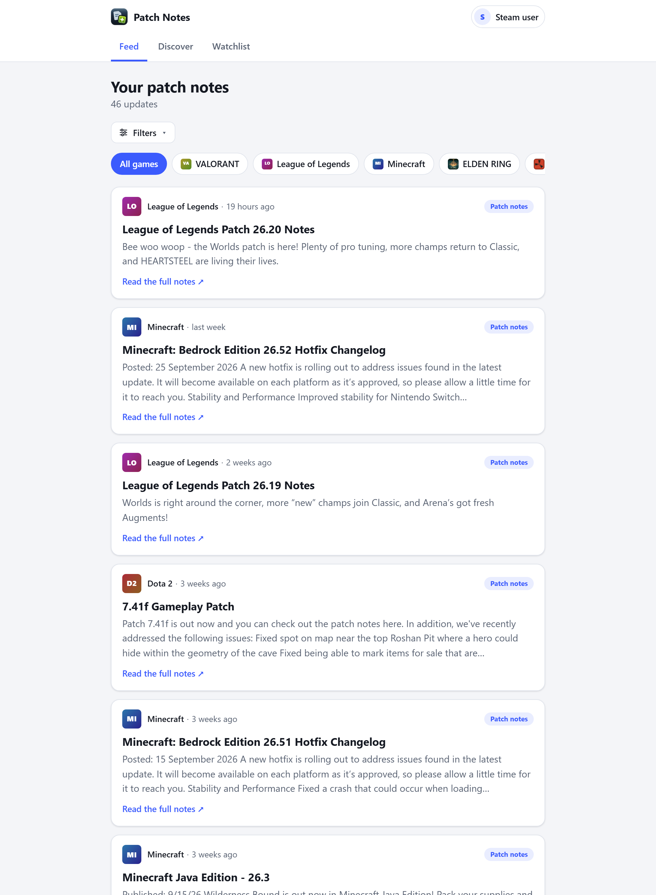
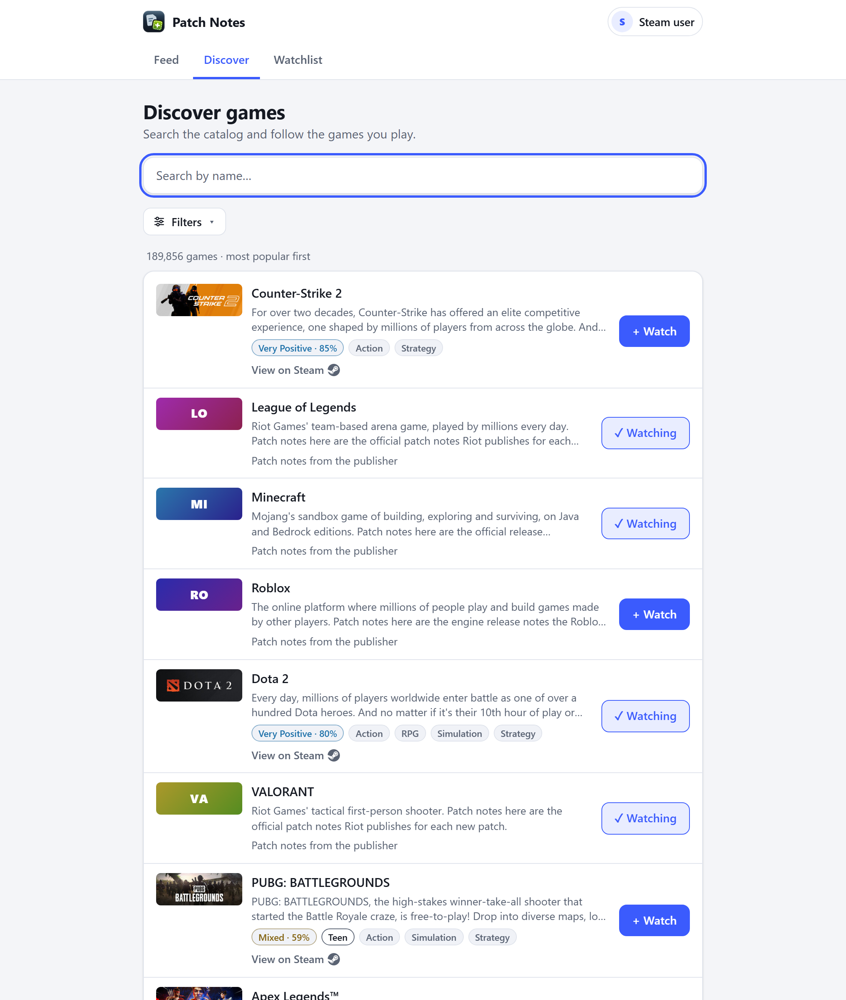
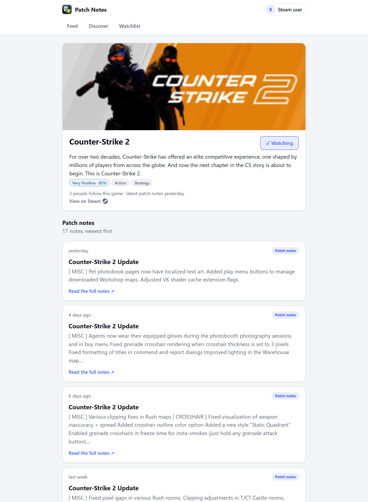
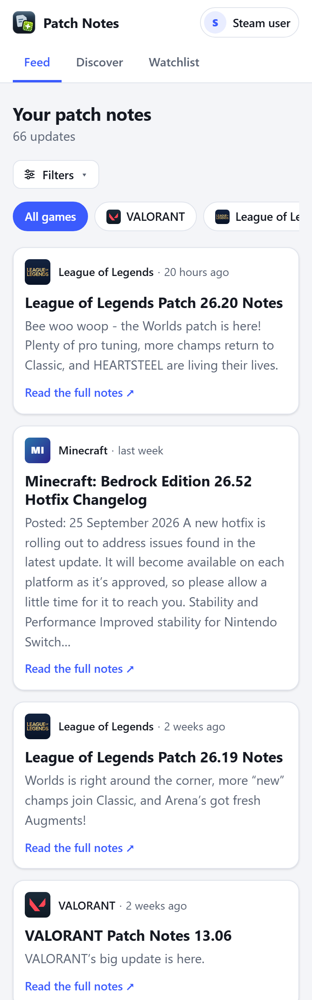
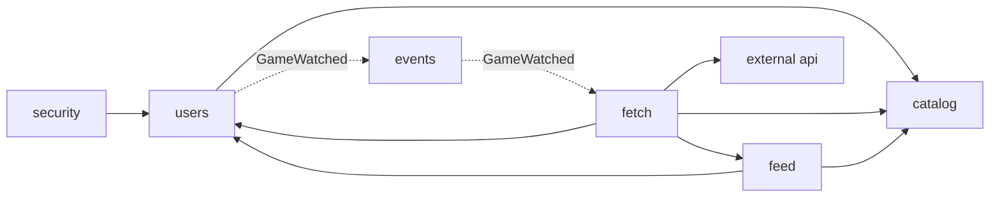

# Game Patch Notes Aggregator

[](https://github.com/Vandrae/patch-notes-aggregator/actions/workflows/ci.yml)

`main` is protected: every change goes through a pull request, and it can only be merged once all four CI jobs pass (the
backend tests, the frontend tests, the real-browser tests, and a full Docker and MySQL smoke test). See [Testing and CI](docs/testing.md).

Follow the games you play and read their official patch notes in one clean, newest-first feed. Search the whole Steam
catalog (about 190,000 games), follow what you care about, and the app fetches each game's notes from its publisher, boils
them down to a short plain-text excerpt, and links you to the full notes.

It was built to demonstrate the parts of a backend that a lot of portfolio projects skip: **scheduled background jobs,
third-party API integration, normalizing data from inconsistent sources, and real authentication**, plus the engineering
around them: an enforced module structure, tests against a real MySQL and in a real browser, CI, and a production Docker
stack with HTTPS.

## What it does

- **Sign in with Steam** (OpenID 2.0, implemented by hand). No passwords and no email: Steam gives the app a SteamID and
  your public name and avatar, and nothing else.
- **Search every Steam game**, ranked by relevance and popularity, with genre, review-rating and age-rating filters.
  [How the catalog works](docs/catalog-and-search.md).
- **Follow games** and read a feed of their patch notes. Each game has its own page with its follower count and full
  history. Only the games somebody follows are ever fetched, on an adaptive schedule that keeps API calls low.
- **Games that are not on Steam** (Roblox, Minecraft, League of Legends, VALORANT) are read from the publishers' own feeds.
  Adding another game that offers a feed is one entry of configuration, no code. [Details and the rules for adding one](docs/non-steam-games.md).
- **Careful with other people's content and your data**: it keeps a short excerpt and a link back, never the full post;
  it logs no addresses or secrets; rate limits protect the sign-in and the Steam calls; there is a privacy page and one
  button to delete your account.

## Screenshots

<table>
  <tr>
    <td width="50%" valign="top">
      
      <br><sub><b>The feed.</b> Patch notes from every game you follow, newest first: a short excerpt and a link to the full notes.</sub>
    </td>
    <td width="50%" valign="top">
      
      <br><sub><b>Finding games.</b> Search all of Steam (about 190,000 games) with covers, review ratings, age ratings and genre filters.</sub>
    </td>
  </tr>
  <tr>
    <td width="50%" valign="top">
      
      <br><sub><b>A game's page.</b> Cover, rating, how many people follow it, and its full patch-note history.</sub>
    </td>
    <td width="50%" valign="top" align="center">
      
      <br><sub><b>On a phone.</b> The same app, laid out for a small screen.</sub>
    </td>
  </tr>
</table>

<sub>Taken from the real catalog with sign-in faked, so no one's account appears; regenerate them with `npm run screenshots` in `e2e/` ([how](docs/testing.md#screenshots)). Covers and patch-note excerpts belong to their games' publishers.</sub>

## Built with

| | |
|---|---|
| Backend | Java 21, Spring Boot 4, Spring Modulith (module boundaries checked by a test), Spring Security, Spring Data JPA, Flyway |
| Data | H2 for local runs, MySQL 8.4 for production |
| Frontend | React 19, TypeScript, Vite, TanStack Query, React Router |
| Run and ship | Docker, Caddy (automatic HTTPS), GitHub Actions |
| Tests | JUnit, Testcontainers (real MySQL), Vitest and Testing Library, Playwright |

## Quick start

You need **JDK 21 or newer** (check that `JAVA_HOME` points at one). There is no database to set up: by default it uses a
file-backed H2 in `./data`.

```bash
./mvnw package                                              # tests, builds the web UI, and one jar that serves both
java -jar target/patch-notes-aggregator-0.1.0-SNAPSHOT.jar  # then open http://localhost:8080
```

The first `./mvnw package` downloads a project-local Node into `web/node/` (nothing system-wide). Add
`-Dskip.frontend=true` for a faster, Java-only build.

**Configuration** goes in a git-ignored `.env`: copy `.env.example` and fill in what you need.

| Setting | What it does |
|---|---|
| `STEAM_API_KEY` | Lets the app import the full Steam catalog and read your Steam name and avatar at sign-in. [Get a key](https://steamcommunity.com/dev/apikey). Without one, only a starter game is searchable. |
| `JWT_SECRET` | Signs the session cookie (32+ random characters; `openssl rand -base64 48`). Without it a random one is made on every start and everyone is signed out on restart. |

On the first start the catalog imports in about 15 seconds, and covers, ratings and genres fill in over the next hour or so
in the background. Search works throughout.

**Other ways to run it**

- **Working on the UI:** start the backend with `PUBLIC_BASE_URL=http://localhost:5173`, then in `web/` run `npm run dev`
  (the dev server on <http://localhost:5173> proxies `/api` to the backend).
- **MySQL instead of H2:** `docker compose up -d`, then run with `--spring.profiles.active=mysql`.
- **The whole production stack** (the app, MySQL and HTTPS) with one command: see [deployment](docs/deployment.md).

## Architecture at a glance

One deployable application split into modules whose boundaries a test enforces, so a stray import across a boundary fails the
build:



Following a game publishes an event; the fetch module reads that game's source (Steam's news API, or a publisher's feed),
normalizes every item into one shape, and hands it to the feed module, which stores it and serves each user's feed. A
scheduler then asks about each followed game again at a pace that depends on how recently it was patched.
[Architecture in full](docs/architecture.md).

## Documentation

| | |
|---|---|
| [Architecture](docs/architecture.md) | the modules, how a request travels, the adaptive polling schedule, what Steam's data looks like |
| [The catalog and search](docs/catalog-and-search.md) | importing every Steam game, ranking, covers, ratings and filters |
| [Games that are not on Steam](docs/non-steam-games.md) | how they are added, which are, which are not and why, and how Riot's pages are read gently |
| [API reference](docs/api.md) | every route, and how sessions and CSRF protection work |
| [Security, privacy and compliance](docs/security-and-compliance.md) | headers, rate limits, what is logged, Steam's terms and how the app stands against them |
| [Testing and CI](docs/testing.md) | the four test layers, the real-MySQL and browser tests, the pipeline |
| [Deployment](docs/deployment.md) | the Docker stack, and a step-by-step guide for one small AWS server |
| [Design notes](docs/design.md) | the original plan, the design decisions and edge cases, and the build order |

## Feedback

Tried it, or just read the code? I'd like to hear what was confusing, what you'd add, or what worked. [Open a feedback
issue](https://github.com/Vandrae/patch-notes-aggregator/issues/new?template=feedback.yml): it is a short form and takes a
minute. Issues are public, so please leave out personal details.

## Project layout

```
src/main/java/com/vandrae/patchnotes/   the backend, one package per module
src/main/resources/                     configuration and the Flyway database migrations
src/test/                               backend tests
web/                                    the React app (built into the jar)
e2e/                                    browser tests (Playwright) and the fake Steam they use
docs/                                   the documentation above
Dockerfile, compose.prod.yaml, Caddyfile  the production stack
.github/workflows/ci.yml                the CI pipeline
```

## Status

Feature-complete and ready to deploy; not yet running on a public address. Ideas not built: a slower polling tier for games
that have not been patched in a year, an OpenAPI description of the API, ending a session before its 7 days are up, and more
non-Steam games (the rest of the most-streamed ones publish no official feed yet; see [the list](docs/non-steam-games.md)).

*Not affiliated with Valve or Riot Games. Steam is a trademark of Valve Corporation; League of Legends and VALORANT are
trademarks of Riot Games, Inc.*
