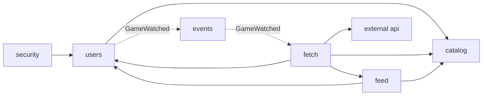

# Architecture

One deployable Spring Boot application, split into modules with enforced boundaries; a scheduler that fetches patch notes only for games somebody follows; and a normalizer that turns every source into one shape. The original design notes and the reasoning behind them are in [design.md](design.md).

## Modular monolith

One deployable, eight modules. Each is a top-level package whose root holds its public API and whose
`internal` sub-package is off limits to other modules. The allowed dependencies are declared in each module's
`package-info.java` and **enforced by a test** ([ModularityTests](../src/test/java/com/vandrae/patchnotes/ModularityTests.java),
Spring Modulith), so a stray import across a boundary fails the build.

| Module | Responsibility |
|---|---|
| `users` | accounts + watchlist ("User Watch"); no auth logic |
| `security` | "Sign in through Steam" (OpenID 2.0), HS256 JWT session cookie, CSRF, HTTP security rules |
| `catalog` | game catalog + search; seeded from `app.catalog.seed-games` |
| `externalapi` | Steam client with timeouts and retry/backoff; returns Steam's own DTOs |
| `fetch` | scheduled poller, on-demand fetch, `ArticleSource` adapters, normalizer |
| `feed` | article storage (upsert + dedup) and the per-user feed endpoint |
| `events` | shared event contracts (`GameWatched`, `ArticlesIngested`) |
| `web` | serves the React app (built from `web/`) at its client-side routes |

*The design diagram: the modules on the bottom right, and how a request travels through them in each of the three flows.
The diagram predates the `web` module, which only serves the React app.*

The three flows from the design diagram map to code like this:

- **Flagging a game:** `PUT /api/watchlist/{id}` → JWT check → catalog existence check → save → publish `GameWatched`.
- **Finding patches:** `GameWatched` (immediately) or the adaptive scheduled poll (below) → fetch → Steam API → normalize → feed (upsert) → publish `ArticlesIngested`.
- **User opens app:** JWT check → feed query scoped to the caller's watchlist.

`GameWatched` is delivered through Modulith's persisted event registry, so an unprocessed event survives a crash
and is re-published on restart. Nothing consumes `ArticlesIngested` yet; it is the hook for notifications.

## Adaptive polling

Asking Steam about every watched game every 30 minutes costs 48 calls a day per game whether it patches daily or yearly,
which does not scale (5,000 watched games would be ~240,000 calls a day). Instead each watched game has its own schedule
in `game_fetch_state`, and the poller wakes every 30 seconds to take whichever games are due.

- **When to look again** (`PollSchedule`, pure arithmetic): after a successful poll, the wait is the time since the game's
  newest patch note divided by 4, kept between 15 minutes and 24 hours. A game patched an hour ago is checked within the
  hour; one patched last week, daily; a game with no patch notes (or no news feed) daily. A new patch note snaps a quiet game
  back to frequent checks by itself, with no counters to keep. Waits are shortened by up to 10% at random so games do not all
  fall due together; because jitter only shortens, **no watched game goes unchecked for more than 24 hours**.
- **Failures** back off on their own schedule (5 minutes, doubling, up to 6 hours) and never delay other games.
- **Pacing:** requests leave at a steady 5 per second (measured: Steam's news API did not throttle 100 uncached requests at
  about 4 per second). If Steam answers HTTP 429 the poller slows down, stands down for 30 seconds and leaves the rest due.
  Retrying a 429 immediately would only count against the limit, so the news client reports it instead of retrying.
- **On demand:** starting to watch a game still fetches it at once, and that fetch sets the game's schedule too, so it is not
  polled again straight away. Games nobody watches lose their schedule row and are never polled.
- **Metrics** (Micrometer; deliberately not exposed over HTTP, since there is no one to look at a dashboard and every public route is surface to defend): `patchnotes.fetch.polls` by outcome, `patchnotes.fetch.articles`,
  `patchnotes.fetch.tracked`, `patchnotes.fetch.due` and `patchnotes.fetch.lag.seconds` (how long the most overdue game has
  waited; a number that keeps growing means the poller cannot keep up). Decided: they stay unexposed. The per-tick "Poll tick" log
  line, Steam throttling warnings and the rate-limit summary line are the signals to watch in `docker compose logs`. If you ever want
  live metrics, a management port reachable only over SSH is the way; the security rules would need a small change for it.
- **Tuning** is under `app.fetch` in `application.yml`. The 24-hour cap comes from one method, `PollSchedule.maxIntervalFor`,
  which is where a slower tier (say weekly checks for games with no patch note in a year) will plug in.

With the illustrative mix of 5% busy, 25% moderate and 70% quiet games, 5,000 watched games come to roughly 22,000 calls a day
instead of 240,000 (an estimate, not a measurement). One instance only: the overlap guard is in-memory, so several instances
would need a lease on the state rows.

## What the Steam data actually looks like

Checked against the live API for Dragonwilds, and the normalizer's tests use these real titles:

- The feed mixes developer posts (`feed_type=1`) with press and SteamDB links (`feed_type=0`); only the former can be patch notes.
- The `patchnotes` tag is only set on *some* real patches ("1.0.0.5 Patch Notes" lacks it), and the other tags are moderation noise.
- Many real patches never say "patch": "0.12.0.4 is live!". Meanwhile "An Update From Mod Dutch", "Update Survey" and
  "0.12.1 Preview" say "update" or carry a version number but aren't patches.

So classification is: developer tag → trusted; otherwise first-party only, then title heuristics (patch/hotfix/changelog,
`Update N`, or a 3+ part version number) minus survey/preview/roadmap. Bodies are BBCode (`[list][*][p]…`) and are
flattened to a ≤280-char plain-text summary; a SHA-256 of the full body detects silent edits and updates the row in place.
